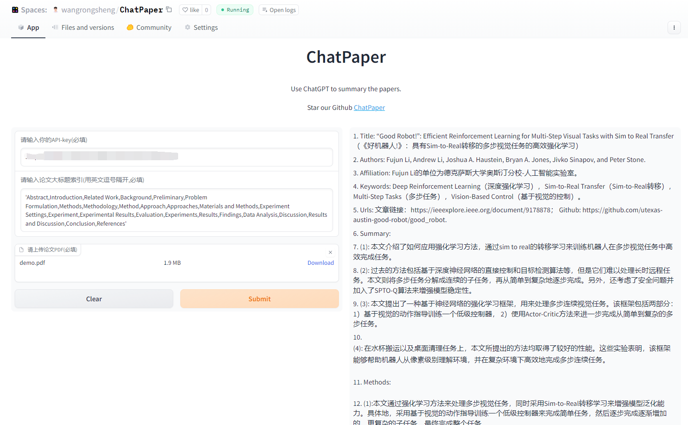

# ChatPaper

<div style="font-size: 1.5rem;">
  <a href="./README.md">中文</a> |
  <a href="./readme_en.md">English</a>
</div>
</br>

To keep up with the huge arxiv papers and AI’s fast progress, we humans need to evolve. We download the latest papers on arxiv based on user keywords, and use ChatGPT3.5 API’s powerful summarization to condense them into a fixed format with minimal text and easy readability. We provide the most information for everyone to choose which papers to read deeply.

我们为ChatPaper提供了一个Web图形界面。您可以选择在私有或者公共环境中部署ChatPaper，也可以在Hugging Face上[在线体验](https://huggingface.co/spaces/wangrongsheng/ChatPaper) 我们所提供的公共服务。

**这个功能免费，且代码开源，大家放心使用！**



> [私有化部署](./deploy/Private/README.md) 、公共化部署，我们推荐您直接使用Hugging Face [在线体验](https://huggingface.co/spaces/wangrongsheng/ChatPaper) 。

## TODO list:
1. 将提问换成英文--已经完成
2. 用更加鲁棒的方法解析Method章节--使用交互模式，来判断
3. 打包成exe文件，供小白用户直接使用。--放弃这个功能，全力打造网页版
4. 如果有佬愿意搭建网站，也可以合作--已经合作
5. 实现一个ChatReview版本，供大家审稿的时候参考（但可能有学术伦理问题）--正在尝试
6. 其他的优化功能正在添加：本地PDF批量总结；token的自动评估；

## 动机

面对每天海量的arxiv论文，以及AI极速的进化，我们人类必须也要一起进化才能不被淘汰。

作为中科大强化学习方向的博士生，我深感焦虑，现在AI的进化速度，我开脑洞都赶不上。

因此我开发了这款ChatPaper，尝试用魔法打败魔法。

ChatPaper是一款论文总结工具。AI用一分钟总结论文，用户用一分钟阅读AI总结的论文。

它可以根据用户输入的关键词，自动在arxiv上下载最新的论文，再利用ChatGPT3.5的API接口强大的总结能力，将论文总结为固定的格式，以最少的文本，最低的阅读门槛，为大家提供最大信息量，以决定该精读哪些文章。

也可以提供本地的PDF文档地址，直接处理。

一般一个晚上就可以速通一个小领域的最新文章。我自己测试了两天了。

祝大家在这个极速变化的时代中，能够和AI一起进化！

这段代码虽然不多，但整个流程走通也花了我近一周的时间，今天分享给大家。

不知道能不能用这个工具，实现我小时候的梦想-- **如果每个中国人给我一块钱，那我就发财了** 哈哈~

言归正传，不强制付费，但是真的希望每个觉得能帮你节省时间的研究生，在花几块钱买API的同时，能够给我一块钱奖励，非常感谢！

您的支持，是我持续更新的动力！如果有商用的大佬，多支持也是欢迎的~

<div style="text-align: center;">
  
</div>

<div style="text-align: center;">
  
</div>

## 使用步骤：
Windows,mac和Ubuntu系统应该都可以；

python版本最好是3.9，其他版本应该也没啥问题

1. 在apikey.ini中填入你的openai key。注意，这个代码纯本地项目，你的key很安全！如果不被OpenAI封的话~
小白用户比较多，我直接给截图示意下可能会更好：
<div style="text-align: center;">
  
</div>

2. 使用过程要保证全局代理！
如果客户端时clash的话，可以参考这个进行配置:

<div style="text-align: center;">
  
</div>

3. 安装依赖：最好翻墙，或者用国内源。
``` bash
pip install -r requirements.txt
```

4. 运行chat_paper.py， 比如：
```python
python chat_paper.py --query "chatgpt robot" --filter_keys "chatgpt robot" --max_results 1

```

B站讲解视频：[我把ChatPaper开源了！AI速读PDF论文和速通Arxiv论文](https://www.bilibili.com/video/BV1EM411x7Tr/)

**注意：key_word不重要，但是filter_keys非常重要！**
一定要修改成你的关键词。

另外关于arxiv的搜索关键词可以参考下图：
<div style="text-align: center;">
  
</div>

5. 参数介绍：
``

[--pdf_path 是否直接读取本地的pdf文档？如果不设置的话，直接从arxiv上搜索并且下载] 
[--query 向arxiv网站搜索的关键词，有一些缩写示范：all, ti(title), au(author)，一个query示例：all: ChatGPT robot] 
[--key_word 你感兴趣领域的关键词，重要性不高] 
[--filter_keys 你需要在摘要文本中搜索的关键词，必须保证每个词都出现，才算是你的目标论文] 
[--max_results 每次搜索的最大文章数，经过上面的筛选，才是你的目标论文数，chat只总结筛选后的论文] 
[--sort arxiv的排序方式，默认是相关性，也可以是时间，arxiv.SortCriterion.LastUpdatedDate 或者 arxiv.SortCriterion.Relevance， 别加引号] 
[--save_image 是否存图片，如果你没注册gitee的图床的话，默认为false] 
[--file_format 文件保存格式，默认是markdown的md格式，也可以是txt] 

parser.add_argument("--pdf_path", type=str, default='', help="if none, the bot will download from arxiv with query")
parser.add_argument("--query", type=str, default='all: ChatGPT robot', help="the query string, ti: xx, au: xx, all: xx,")    
parser.add_argument("--key_word", type=str, default='reinforcement learning', help="the key word of user research fields")
parser.add_argument("--filter_keys", type=str, default='ChatGPT robot', help="the filter key words, 摘要中每个单词都得有，才会被筛选为目标论文")
parser.add_argument("--max_results", type=int, default=1, help="the maximum number of results")
parser.add_argument("--sort", default=arxiv.SortCriterion.Relevance, help="another is arxiv.SortCriterion.LastUpdatedDate")    
parser.add_argument("--save_image", default=False, help="save image? It takes a minute or two to save a picture! But pretty")
parser.add_argument("--file_format", type=str, default='md', help="导出的文件格式，如果存图片的话，最好是md，如果不是的话，txt的不会乱")

```

## 常见网络报错：
调用openai的chatgpt api时出现APIConnectionError, 如何解决?
参考知乎回答：
https://www.zhihu.com/question/587322263/answer/2919916984

直接在chat_paper.py里加上

os.environ["http_proxy"] = "http://<代理ip>:<代理端口>"
os.environ["https_proxy"] = "http://<代理ip>:<代理端口>"

代理ip和端口需要你在Windows系统里面查找。


API被OpenAI禁了的报错：


这种情况只能用新号了。另外一定要注意一个号尽量不要多刷，节点一定要靠谱，千万不能用大陆和香港的节点，用了就寄。


## 是否插图？以及插图教程：
先不加了

## 项目的使用技巧：
快速刷特定关键词的论文，不插图的话，每张篇文章需要花一分钟，阅读时间差不多一分钟。

本项目可以用于跟踪领域最新论文，或者关注其他领域的论文，可以批量生成总结，最大可生成1000（如果你能等得及的话）。
虽然Chat可能有瞎编的成分，但是在我的规范化提问的框架下，它的主要信息是保熟的。

数字部分需要大家重新去原文检查！

找到好的文章之后，可以精读这篇文章。

推荐另外两个精读论文的AI辅助网站：https://typeset.io/ 和chatpdf。
我的教程： [强化学徒：论文阅读神器SciSpace(Typeset.io)测评-和AI一起进化](https://zhuanlan.zhihu.com/p/611874187)

和上面这两个工具的主要优势在于，ChatPaper可以批量自动总结最新论文，可以极大的降低阅读门槛，尤其是我们国人。
缺点也很明显，ChatPaper没有交互功能，不能连续提问，但我觉得这个重要性不大~


## 解析示例：

<h2>Paper:1</h2>
<ol>
<li>
<p>Title: Diffusion Policy: Visuomotor Policy Learning via Action Diffusion 中文标题: 通过行为扩散的视觉运动策略学习</p>
</li>
<li>
<p>Authors: Haonan Lu, Yufeng Yuan, Daohua Xie, Kai Wang, Baoxiong Jia, Shuaijun Chen</p>
</li>
<li>
<p>Affiliation: 中南大学</p>
</li>
<li>
<p>Keywords: Diffusion Policy, Visuomotor Policy, robot learning, denoising diffusion process</p>
</li>
<li>
<p>Urls: http://arxiv.org/abs/2303.04137v1, Github: None</p>
</li>
<li>
<p>Summary:</p>
</li>
</ol>
<p>(1): 本文研究的是机器人视觉动作策略的学习。机器人视觉动作策略的学习是指根据观察到的信息输出相应的机器人运动动作，这一任务较为复杂和具有挑战性。</p>
<p>(2): 过去的方法包括使用高斯混合模型、分类表示，或者切换策略表示等不同的动作表示方式，但依然存在多峰分布、高维输出空间等挑战性问题。本文提出一种新的机器人视觉运动策略模型 - Diffusion Policy，其结合了扩散模型的表达能力，克服了传统方法的局限性，可以表达任意分布并支持高维空间。本模型通过学习代价函数的梯度，使用随机Langevin动力学算法进行迭代优化，最终输出机器人动作。</p>
<p>(3): 本文提出的机器人视觉动作策略 - Diffusion Policy，将机器人动作表示为一个条件去噪扩散过程。该模型可以克服多峰分布、高维输出空间等问题，提高了策略学习的表达能力。同时，本文通过引入展望控制、视觉诱导和时间序列扩散变换等技术，继续增强了扩散策略的性能。</p>
<p>(4): 本文的方法在11个任务上进行了测试，包括4个机器人操纵基准测试。实验结果表明，Diffusion Policy相对于现有的机器人学习方法，表现出明显的优越性和稳定性，平均性能提升了46.9%。</p>
<p></p>
<p>7.Methods:
本文提出的视觉动作策略学习方法，即Diffusion Policy，包括以下步骤：</p>
<p>(1) 建立条件去噪扩散过程：将机器人动作表示为一个含有高斯噪声的源的条件随机扩散过程。在该过程中，机器人状态作为源，即输入，通过扩散过程输出机器人的运动动作。为了将其变为条件随机扩散模型，我们加入了代价函数，它在路径积分中作为条件。</p>
<p>(2) 引入随机Langevin动力学：将学习代价函数的梯度转换为基于随机Langevin动力学的迭代优化问题。该方法可以避免显示计算扩散过程，并且可以满足无导数优化器的要求，使其受益于渐近高斯性质以及全局收敛性质。</p>
<p>(3) 引入扩散策略增强技术：使用展望控制技术，结合决策网络，对由扩散产生的动作进行调整，从而增强策略的性能。同时，引入视觉诱导以及时间序列扩散变换，来进一步提高扩散策略的表达能力。</p>
<p>(4) 在11个任务上进行测试：测试结果表明，该方法相对于现有的机器人学习方法，在机器人操纵基准测试中表现出明显的优越性和稳定性，平均性能提升了46.9%。</p>
<p>7.Conclusion: </p>
<p>(1):本文研究了机器人视觉动作策略的学习方法，提出了一种新的机器人视觉运动策略模型 - Diffusion Policy，通过引入扩散模型的表达能力，克服了传统方法的局限性，可以表达任意分布并支持高维空间。实验结果表明，该方法在11个任务上均表现出明显的优越性和稳定性，相对于现有机器人学习方法，平均性能提高了46.9%，这一研究意义巨大。</p>
<p>(2):虽然本文提出了一种新的机器人视觉动作策略学习方法，并在实验中取得了良好的表现，但该方法的优化过程可能比较耗时。此外，该方法的性能受到多种因素的影响，包括演示的质量和数量、机器人的物理能力以及策略架构等，这些因素需在实际应用场景中加以考虑。</p>
<p>(3):如果让我来推荐，我会给这篇文章打9分。该篇文章提出的Diffusion Policy方法具有较高的可解释性、性能表现良好、实验结果稳定等优点，能够为机器人视觉动作策略学习等领域带来很大的启发与借鉴。唯一的不足可能是方法的优化过程需要投入更多的时间和精力。</p>
