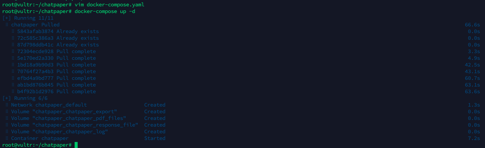

<div style="font-size: 1.5rem;">
  <a href="./README.md">中文</a> |
  <a href="./readme_en.md">English</a>
</div>
</br>


💥💥💥<strong>7.22 仓库的文件做了一个整理，可能会有些路径和bug，正在修复中。
增加全新的本地PDF全文翻译功能！有空再写配置教程。
 </strong>

<details><summary><code><b>历史重大更新</b></code></summary>

- 🌟*2023.07.22*: 增加全新的本地PDF全文翻译功能！
- 🌟*2023.07.21*: 仓库的文件做了一个整理，可能会有些路径和bug，正在修复中。
- 🌟*2023.07.09*: 师弟[red-tie](https://github.com/red-tie)在[auto-draft](https://github.com/CCCBora/auto-draft)的基础上，优化了一款[一键文献综述](https://github.com/kaixindelele/ChatPaper/tree/main/auto_survey)的功能. 适用于大家对具体某个领域快速掌握，并且支持直接生成中文文献调研报告。文件配置简单，欢迎大家使用和反馈！
- 🌟*2023.07.05*: 昨天我做了一个新的小玩具：[ChatSensitiveWords](https://github.com/kaixindelele/ChatSensitiveWords)，利用LLM+敏感词库，来自动判别是否涉及敏感词。已经在学术版GPT网页端上线，欢迎LLM的开发者一起完善这个工作。
- 🌟*2023.04.30*: **唯一官方网站：**[https://chatpaper.org/](https://chatpaper.org/) ，以及小白教程【ChatPaper网页版使用小白教程-哔哩哔哩】 https://b23.tv/HpDkcBU， 第三方文档：https://chatpaper.readthedocs.io . 
- 🌟*2023.04.22*: 为了庆祝ChatPaper获得一万⭐，我们将联合两位同学，推出两个AI辅助文献总结工具，第一个是[auto-draft](https://github.com/CCCBora/auto-draft)，AI自动搜集整理出文献总结！
- 🌟*2023.04.17*: 为了降低学术伦理风险，我们为Chat_Reviewer增加了复杂的文字注入，效果如图：[示例图](https://github.com/kaixindelele/ChatPaper/blob/main/images/reviews.jpg) ，希望各位老师同学在使用的时候，一定要注意学术伦理和学术声誉，不要滥用工具。如果谁有更好的方法来限制少数人的不规范使用，欢迎留言，为科研界做一份贡献。
- 🌟*2023.03.31*: 目前已经离线总结了3w+的CCF-A会议论文了，以后大家可以不用等那么久了！
- 🌟*2023.03.28*: 荣胜同学今天发布了一个非常有意思的工作[ChatGenTitle](https://github.com/WangRongsheng/ChatGenTitle)，提供摘要生成标题，基于220wArXiv论文的数据微调的结果！
- 🌟*2023.03.23*: chat_arxiv.py可以从arxiv网站，根据关键词，最近几天，几篇论文，直接爬取最新的领域论文了！解决了之前arxiv包的搜索不准确问题！
- 🌟*2023.03.23*: ChatPaper终于成为完成体了！现在已经有论文总结+论文润色+论文分析与改进建议+论文审稿回复等功能了！


</details>

<h1 align="center">ChatPaper</h1>
<div align="center">
  <a href="https://github.com/kaixindelele/ChatPaper">
  
  </a>

  <p align="center">
    <h3>希望让语言不再成为中国人获取最新知识的障碍</h3>
      <a href="https://github.com/kaixindelele/ChatPaper/graphs/contributors">
        
      </a>
      <a href="https://github.com/kaixindelele/ChatPaper/issues">
        
      </a>
      <a href="https://github.com/kaixindelele/ChatPaper/pulls">
        
      <a href="https://github.com/kaixindelele/ChatPaper/stargazers">
        
      </a>
      <br/>
      <em>一站式服务 / 简单 / 快速 / 高效 </em>
      <br/>
      <a href="https://www.bilibili.com/video/BV1EM411x7Tr/"><strong>视频教程</strong></a>
        ·
      <a href="https://chatpaper.org/"><strong>在线体验</strong></a>
    </p>

  </p>
</div>

<h1 align="center">ChatPaper全流程加速科研：论文总结+专业级翻译+润色+审稿+审稿回复</h1>

|工具名称|工具作用|是否在线？|在线预览|备注|
|:-|:-|:-|:-|:-|
|ChatPaper|通过ChatGPT实现对**论文进行总结，帮助科研人进行论文初筛**|访问[chatpaper.org](https://chatpaper.org/) 使用| |[原项目地址](https://github.com/kaixindelele/ChatPaper)|
|ChatReviewer|利用ChatGPT对论文进行**优缺点分析，提出改进建议**|访问[ShiwenNi/ChatReviewer](https://huggingface.co/spaces/ShiwenNi/ChatReviewer) 使用||[原项目地址](https://github.com/nishiwen1214/ChatReviewer)|
|ChatImprovement|利用ChatGPT对**论文初稿进行润色、翻译等**|访问[学术版GPT](http://academic.chatwithpaper.org/) 使用||[原项目地址](https://github.com/binary-husky/chatgpt_academic)|
|ChatResponse|利用ChatGPT对**审稿人的提问进行回复**|访问[ShiwenNi/ChatResponse](https://huggingface.co/spaces/ShiwenNi/ChatResponse) 使用||[原项目地址](https://github.com/nishiwen1214/ChatReviewer)|
|ChatGenTitle|利用百万arXiv论文元信息训练出来的论文题目生成模型，**根据论文摘要生成合适题目**|<a href="https://drive.google.com/file/d/1akrC4-YnYdiyD1_VK-92hncN7HS0FLf5/view?usp=sharing" target="_parent"></a>||[原项目地址](https://github.com/WangRongsheng/ChatGenTitle)|

> **所有功能免费，代码开源，大家放心使用！** 关于API如何获取，首先你得有一个没有被封的ChatGPT账号，然后[获取Api Key](https://chatgpt.cn.obiscr.com/blog/posts/2023/How-to-get-api-key/) ,填入即可！

## 目录：

- [💥最新讯息](#最新讯息)
- [💫开发动机](#开发动机)
- [⛏️配置教程](#配置教程)
- [👷‍♂️HuggingFace在线部署](#HuggingFace在线部署)
- [📄本地PDF全文翻译示例](#本地PDF全文翻译示例)
- [📄本地PDF全文总结示例](#本地PDF全文总结示例)
- [📄全文总结示例](#全文总结示例)
- [👁️‍🗨️使用技巧](#使用技巧)
- [🛠️常见报错](#常见报错)
- [💐项目致谢](#项目致谢)
- [🌟赞助我们](#赞助我们)
- [🌈Starchart](#Starchart)
- [🏆Contributors](#Contributors)


## 最新讯息
- 🌟*2023.07.22*: 增加全新的本地PDF全文翻译功能！有空再写配置教程。
- 🌟*2023.07.21*: 仓库的文件做了一个整理，可能会有些路径和bug，正在修复中。
- 🌟*2023.07.09*: 师弟[red-tie](https://github.com/red-tie)在[auto-draft](https://github.com/CCCBora/auto-draft)的基础上，优化了一款[一键文献综述](https://github.com/kaixindelele/ChatPaper/tree/main/auto_survey)的功能. 适用于大家对具体某个领域快速掌握，并且支持直接生成中文文献调研报告。文件配置简单，欢迎大家使用和反馈！
- 🌟*2023.07.05*: 昨天我做了一个新的小玩具：[ChatSensitiveWords](https://github.com/kaixindelele/ChatSensitiveWords)，利用LLM+敏感词库，来自动判别是否涉及敏感词。已经在学术版GPT网页端上线，欢迎LLM的开发者一起完善这个工作。
- 🌟*2023.04.30*: **唯一官方网站：**[https://chatpaper.org/](https://chatpaper.org/) ，以及小白教程【ChatPaper网页版使用小白教程-哔哩哔哩】 https://b23.tv/HpDkcBU， 第三方文档：https://chatpaper.readthedocs.io . 
- 🌟*2023.04.22*: 为了庆祝ChatPaper获得一万⭐，我们将联合两位同学，推出两个AI辅助文献总结工具，第一个是[auto-draft](https://github.com/CCCBora/auto-draft)，AI自动搜集整理出文献总结！
- 🌟*2023.04.17*: 为了降低学术伦理风险，我们为Chat_Reviewer增加了复杂的文字注入，效果如图：[示例图](https://github.com/kaixindelele/ChatPaper/blob/main/images/reviews.jpg) ，希望各位老师同学在使用的时候，一定要注意学术伦理和学术声誉，不要滥用工具。如果谁有更好的方法来限制少数人的不规范使用，欢迎留言，为科研界做一份贡献。
- 🌟*2023.03.31*: 目前已经离线总结了3w+的CCF-A会议论文了，以后大家可以不用等那么久了！
- 🌟*2023.03.28*: 荣胜同学今天发布了一个非常有意思的工作[ChatGenTitle](https://github.com/WangRongsheng/ChatGenTitle)，提供摘要生成标题，基于220wArXiv论文的数据微调的结果！
- 🌟*2023.03.23*: chat_arxiv.py可以从arxiv网站，根据关键词，最近几天，几篇论文，直接爬取最新的领域论文了！解决了之前arxiv包的搜索不准确问题！
- 🌟*2023.03.23*: ChatPaper终于成为完成体了！现在已经有论文总结+论文润色+论文分析与改进建议+论文审稿回复等功能了！


## 开发动机


<details><summary><code><b>开发动机细节</b></code></summary>


面对每天海量的arxiv论文，以及AI极速的进化，我们人类必须也要一起进化才能不被淘汰。

作为中科大强化学习方向的博士生，我深感焦虑，现在AI的进化速度，我开脑洞都赶不上。

因此我开发了这款ChatPaper，尝试用魔法打败魔法。

ChatPaper是一款论文总结工具。AI用一分钟总结论文，用户用一分钟阅读AI总结的论文。

它可以根据用户输入的关键词，自动在arxiv上下载最新的论文，再利用ChatGPT3.5的API接口强大的总结能力，将论文总结为固定的格式，以最少的文本，最低的阅读门槛，为大家提供最大信息量，以决定该精读哪些文章。

也可以提供本地的PDF文档地址，直接处理。

一般一个晚上就可以速通一个小领域的最新文章。我自己测试了两天了。

</details>


祝大家在这个极速变化的时代中，能够和AI一起进化！

欢迎大家的赞助，以帮助支付网页运营的API和服务器成本，并让我们有动力继续开发更多更高质量的服务！

您的支持，是我持续更新的动力和赞赏！

<div style="text-align: center;">
  
</div>

欢迎大家加入光荣的进化！

## 技术原理：


<details><summary><code><b>技术原理细节</b></code></summary>

论文总结遵循下面四个问题：

1. 研究背景

2. 过去的方案是什么？他们有什么问题？

3. 本文方案是什么？具体步骤是什么？

4. 本文在哪些任务中，取得了什么效果？

基本上是大家做论文汇报的主要内容了。

实现细节：
提取摘要和introduction的内容，因为abstract很少会告诉你过去的方案是什么，存在什么问题。

然后提取method章节，总结方法的具体步骤

最后提取conclusion章节，总结全文。

分三次总结和喂入，如果每个部分超过了长度，则截断（目前这个方案太粗暴了，但也没有更好的更优雅的方案）

作为初筛，勉强够用。

</details>


## 配置教程

<details><summary><code><b>配置教程细节</b></code></summary>


### 一、以脚本方式运行

Windows, Mac和Linux系统应该都可以

python版本最好是3.9，其他版本应该也没啥问题

1. 在apikey.ini中填入你的openai key。注意，这个代码纯本地项目，你的key很安全！如果不被OpenAI封的话~
小白用户比较多，我直接给截图示意下可能会更好：
<div style="text-align: center;">
  
</div>

2. 使用过程要保证全局代理！
如果客户端时clash的话，可以参考这个进行配置:

<div style="text-align: center;">
  
</div>

3. 安装依赖：最好翻墙，或者用国内源。
``` bash
pip install -r requirements.txt
```

4.1. Arxiv在线批量搜索+下载+总结： 运行chat_paper.py， 比如：
```python
python chat_paper.py --query "chatgpt robot" --filter_keys "chatgpt robot" --max_results 3
```

更准确的脚本是chat_arxiv.py，使用方案，命令行更加简洁：
```python
python chat_arxiv.py --query "chatgpt robot" --page_num 2 --max_results 3 --days 10
```

其中query仍然是关键词，page_num是搜索的页面，每页和官网一样，最大是50篇，max_results是最终总结前N篇的文章，days是选最近几天的论文，严格筛选！


**注意：搜索词无法识别`-`，只能识别空格！所以原标题的连字符最好不要用！** 感谢网友提供的信息

4.2. Arxiv在线批量搜索+下载+总结+高级搜索： 运行chat_paper.py， 比如：
```python
python chat_paper.py --query "all: reinforcement learning robot 2023" --filter_keys "reinforcement robot" --max_results 3
```

💥💥💥<strong>7K星了，发布一个猫娘版提示词，希望大家一起让猫娘活起来~：[脚本：chat_arxiv_maomao.py](https://github.com/kaixindelele/ChatPaper/blob/main/chat_arxiv_maomao.py)， [总结图片](https://github.com/kaixindelele/ChatPaper/blob/main/images/maomao.png) </strong>
  


4.3. Arxiv在线批量搜索+下载+总结+高级搜索+指定作者： 运行chat_paper.py， 比如：
```python
python chat_paper.py --query "au: Sergey Levine" --filter_keys "reinforcement robot" --max_results 3
```

4.4. 本地pdf总结： 运行chat_paper.py， 比如：
```python
python chat_paper.py --pdf_path "demo.pdf"
```

4.5. 本地文件夹批量总结： 运行chat_paper.py， 比如：
```python
python chat_paper.py --pdf_path "your_absolute_path"
```

4.6. 谷歌学术论文整理： 运行google_scholar_spider.py， 比如：

```
python google_scholar_spider.py --kw "deep learning" --nresults 30 --csvpath "./data" --sortby "cit/year" --plotresults 1
```

此命令在Google Scholar上搜索与“deep learning”相关的文章，检索30个结果，将结果保存到“./data”文件夹中的CSV文件中，按每年引用次数排序数据，并绘制结果。

具体使用和参数请参考https://github.com/JessyTsu1/google_scholar_spider


4.7. Gitee图床的配置教程（选配，比较麻烦）

效果和配置视频：https://www.bilibili.com/video/BV1Rh4y1173t/
教程文章：https://zhuanlan.zhihu.com/p/644326031


---

另外注意，目前这个不支持**综述类**文章。

B站讲解视频：[我把ChatPaper开源了！AI速读PDF论文和速通Arxiv论文](https://www.bilibili.com/video/BV1EM411x7Tr/)

**注意：key_word不重要，但是filter_keys非常重要！**
一定要修改成你的关键词。

另外关于arxiv的搜索关键词可以参考下图：
<div style="text-align: center;">
  
</div>

5. 参数介绍：
```
[--pdf_path 是否直接读取本地的pdf文档？如果不设置的话，直接从arxiv上搜索并且下载] 
[--query 向arxiv网站搜索的关键词，有一些缩写示范：all, ti(title), au(author)，一个query示例：all: ChatGPT robot] 
[--key_word 你感兴趣领域的关键词，重要性不高] 
[--filter_keys 你需要在摘要文本中搜索的关键词，必须保证每个词都出现，才算是你的目标论文] 
[--max_results 每次搜索的最大文章数，经过上面的筛选，才是你的目标论文数，chat只总结筛选后的论文] 
[--sort arxiv的排序方式，默认是相关性，也可以是时间，arxiv.SortCriterion.LastUpdatedDate 或者 arxiv.SortCriterion.Relevance， 别加引号] 
[--save_image 是否存图片，如果你没注册gitee的图床的话，默认为false] 
[--file_format 文件保存格式，默认是markdown的md格式，也可以是txt] 

parser.add_argument("--pdf_path", type=str, default='', help="if none, the bot will download from arxiv with query")
parser.add_argument("--query", type=str, default='all: ChatGPT robot', help="the query string, ti: xx, au: xx, all: xx,")    
parser.add_argument("--key_word", type=str, default='reinforcement learning', help="the key word of user research fields")
parser.add_argument("--filter_keys", type=str, default='ChatGPT robot', help="the filter key words, 摘要中每个单词都得有，才会被筛选为目标论文")
parser.add_argument("--max_results", type=int, default=1, help="the maximum number of results")
parser.add_argument("--sort", default=arxiv.SortCriterion.Relevance, help="another is arxiv.SortCriterion.LastUpdatedDate")    
parser.add_argument("--save_image", default=False, help="save image? It takes a minute or two to save a picture! But pretty")
parser.add_argument("--file_format", type=str, default='md', help="导出的文件格式，如果存图片的话，最好是md，如果不是的话，txt的不会乱")
```


</details>


### 二、 以Flask服务运行

<details><summary><code><b>Flask配置教程</b></code></summary>

注意：更新版本后，可能有路径的报错

1. 下载项目并进入项目目录

```text
git clone https://github.com/kaixindelele/ChatPaper.git
cd ChatPaper
```

2. 在项目根目录下的 `apikey.ini` 文件中填入您的 OpenAI 密钥。
3. 配置虚拟环境并下载依赖

```text
pip install virtualenv 
安装虚拟环境工具
virtualenv venv 
新建一个名为venv的虚拟环境
Linux/Mac下:
source venv/bin/activate

Windows下:
.\venv\Scripts\activate.bat

pip install -r requirements.txt
```
4. 启动服务

```text
python3 app.py
# 启动 Flask 服务。运行此命令后，Flask 服务将在本地的 5000 端口上启动并等待用户请求。在浏览器中访问以下地址之一以访问 Flask 服务的主页：
# http://127.0.0.1:5000/
# 或
# http://127.0.0.1:5000/index
```

访问 http://127.0.0.1:5000/ 后，您将看到主页。在主页上，您可以点击不同的链接来调用各种服务。您可以通过修改链接中的参数值来实现不同的效果。有关参数详细信息，请参阅上一步骤中的详细介绍


+ 特别的，这四个接口实际是封装了根目录下四个脚本的 web 界面。参数可以通过链接来修改。例如要运行“arxiv?query=GPT-4&key_word=GPT+robot&page_num=1&max_results=1&days=1&sort=web&save_image=False&file_format=md&language=zh”的话，相当于在根目录下调用 chat_arxiv.py 并返回结果。这个显示的结果和在命令行中调用的结果是一样的（即：python chat_arxiv.py --query "GPT-4" --key_word "GPT robot" --page_num 1 --max_results 1 --days 1 --sort "web" --save_image False --file_format "md" --language "zh"）。您可以通过修改参数来获得其他搜索结果。

如果以这种方式部署的话，结果会保存在同级目录下新生成的export、pdf_files 和response_file三个文件夹里

</details>

### 三、以docker形式运行

<details><summary><code><b>Docker配置教程细节</b></code></summary>

注意：Docker的路径也被我打乱了，很可能存在问题，不推荐尝试。

1. 安装docker和docker-compose，可以参考以下链接

   https://yeasy.gitbook.io/docker_practice/install

   https://yeasy.gitbook.io/docker_practice/compose/install

2. 找地方放项目根目录下的“docker-compose.yaml”文件，将21行的`YOUR_KEY_HERE`替换为自己的openai_key

3. 在同级目录下在命令行运行

   ```
   docker-compose up -d
   ```

4. 这样的界面代表一些正常，随后访问https://127.0.0.1:28460/ 就可以从网页上打开了! 

+ 特别的，如果有改进项目的想法，您可以查看 build.sh、dev.sh、tagpush.sh这三个脚本以及根目录docker目录下文件的作用，相信它们会对你容器化封装项目的思想有进一步提升

+ 所有的运行结果都被保存在 Docker 的 volumes 中，如果想以服务的形式长期部署，您可以将这些目录映射出来。默认情况下，它们位于 /var/lib/docker/volumes/ 下。您可以进入该目录并查看 chatpaper_log、chatpaper_export、chatpaper_pdf_files 和 chatpaper_response_file 四个相关文件夹中的结果。有关 Docker volumes 的详细解释，请参考此链接：http://docker.baoshu.red/data_management/volume.html。

</details>
    
## HuggingFace在线部署

<details><summary><code><b>HuggingFace在线部署细节</b></code></summary>

注意：这部分也是一样，功能暂时被废掉了，建议大家直接使用chatwithpaper.org的网页版。


1. 在[Hugging Face](https://huggingface.co/) 创建自己的个人账号并登录；
2. 进入ChatPaper主仓库：[https://huggingface.co/spaces/wangrongsheng/ChatPaper](https://huggingface.co/spaces/wangrongsheng/ChatPaper) ，您可以在[Files and Version](https://huggingface.co/spaces/wangrongsheng/ChatPaper/tree/main) 看到所有的最新部署代码；
3. [可选]私有化部署使用：点击[Duplicate this space](https://huggingface.co/spaces/wangrongsheng/ChatPaper?duplicate=true) ，在弹出的页面中将`Visibility`选择为`Private`，最后点击`Duplicate Space`，Space的代码就会部署到你自己的Space中，为了方便自己每次调用可以不用填写API-key，您可以将[app.py#L845](https://huggingface.co/spaces/wangrongsheng/ChatPaper/blob/5335124d25b1bc4017a2f5c48b0038dfa545bf63/app.py#L845) 修改为您的密钥：`default="sk-abcdxxxxxxxx"` ，点击保存文件就会立即重新部署了；
4. [可选]公有化部署使用：点击[Duplicate this space](https://huggingface.co/spaces/wangrongsheng/ChatPaper?duplicate=true) ，在弹出的页面中将`Visibility`选择为`Public`，最后点击`Duplicate Space`，Space的代码就会部署到你自己的Space中，这样就可以完成一个公有化的部署。

> 注：公有化部署和私有化部署根据你的需求二选一即可！

</details>


## 本地PDF全文翻译示例

<details><summary><code><b>查看本地PDF全文翻译示例</b></code></summary>

# 强化学习、机器人学和模拟到真实世界的迁移

## Reinforcement Learning, Robotics, Sim-to-Real Transfer


## 摘要

当前的强化学习（Reinforcement Learning，RL）算法在长期任务中存在困难，其中时间可能被浪费在探索死胡同和任务进展可能很容易逆转的地方。我们开发了SPOT框架，该框架在行动安全区域内进行探索，学习有关不安全区域的信息而无需探索它们，并优先考虑逆转先前进展的经验，以实现卓越的学习效果。SPOT框架成功地完成了各种任务的模拟试验，在堆叠4个方块时，将基准试验成功率从13%提高到100%，在创建4个方块的行时，将基准试验成功率从13%提高到99%，在清理敌对模式下排列的玩具时，将基准试验成功率从84%提高到95%。在每次试验中，相对于行动次数，效率通常提高了30%或更多，而训练只需1-20k次行动，具体取决于任务。此外，我们还展示了直接的模拟到真实转移。通过在真实机器人上直接加载经过模拟训练的模型，无需进行额外的真实世界微调，我们能够在100%的试验中创建真实的堆叠，效率为61%，并在100%的试验中创建真实的行，效率为59%。据我们所知，这是首次将成功的模拟到真实转移应用于长期多步骤任务，如堆叠方块和创建行，并考虑到进展的逆转。代码可在https://github.com/jhulcsr/good_robot获取。索引词-计算机视觉用于其他机器人应用，深度学习在抓取和操作中，强化学习。在真实世界环境中，多步骤的机器人任务非常具有挑战性。它们将行动的即时物理后果与了解这些后果如何影响整体目标的进展的需求相结合。此外，与传统的动作规划相反，后者假设具有完美信息和已知的行动模型，学习只能从感知环境中获取有限的空间和时间信息。

## "好机器人！": 用于多步骤视觉任务的高效强化学习与模拟到实际转移（Good Robot!": Efficient Reinforcement Learning for Multi-Step Visual Tasks with Sim to Real Transfer）

图1. 机器人创建的方块堆和行，通过模拟到实际转移。我们的正向任务计划（SPOT）框架可以帮助我们高效地找到能够完成多步骤任务的策略。视频概述：https://youtu.be/MbCuEZadkIw

我们的关键观察是，强化学习在探索行为时会浪费大量时间，而这些行为最多是无效的。例如，在堆叠方块的任务中（图1），人类知道抓取空中的空气永远不会抓住物体，这是“常识”，但对于普通算法来说，可能需要一些时间才能发现。为了解决这个问题，我们提出了正向任务计划（SPOT）框架，以一种能够显著加速学习和最终任务效率的方式将常识约束纳入深度强化学习（DRL）中[1]，[2]。

虽然这些约束是直观的，但将它们以一种能够实现可靠和高效学习的方式纳入深度强化学习中是非常困难的。我们的方法（第三节）受到一种人道而有效的宠物训练方法的启发，有时被称为“正向条件训练”。考虑训练一只名为“Spot”的狗忽略一个她特别感兴趣的物体或事件的目标。当Spot展示出部分符合期望的最终行为时，她会得到奖励，而在逆行的情况下，她会被立即从不得奖励的情况中移开。实现这一目标的一种方法是手中开始有多个奖励，将一个奖励放在Spot的视野中，如果她迫不及待地跳向奖励（一种负面行为），人类会立即夺走并隐藏奖励，以此来对该行为不给予奖励。通过反复训练，Spot最终会犹豫不决，这时她会立即得到称赞“好Spot！”并得到一个奖励，与此同时，她应该忽略的物体也会被移开。这种方法可以扩展到新的情况和行为，并且鼓励探索和快速改进一旦初始的部分成功被实现。正如我们在第三节中所描述的，我们的奖励函数和SPOT-Q学习也被设计成对于逆行的行为既不给予奖励也不进行惩罚。

逆行的情况有不同的复杂性。一方面，无法将第一个方块堆叠在另一个方块上会使机器人处于类似的情况中，因此恢复需要Ω(1)个行动。然而，一旦存在一个由n个方块组成的堆叠，即使成功抓取也可能将整个堆叠推倒，逆转给定试验的整个行动历史（图3），因此恢复需要Ω(n)个行动。对于机器人学习多步骤任务的强化学习来说，后一种更为戏剧化的逆行情况是一个具有挑战性的问题；我们的工作提供了一种高效解决这种情况的方法。

总之，本文的贡献包括：
1）用于多步骤任务的SPOT框架，它在模拟环境中改进了现有技术，并能够高效地在实际情况中进行训练。
2）SPOT-Q学习，一种安全高效的训练方法，其中探索行为在运行时通过掩码进行聚焦，并从过去的经验中生成额外的即时训练样本。
3）从模拟堆叠和行构建任务到实际环境中的零样本领域转移，以及对硬件和场景位置变化的鲁棒性。理想情况下，算法应该能够高效地学习避免这种情况，并通过绿色箭头所示的成功指标来取得成功。因此，需要考虑时间和工作空间的依赖关系。当前时间t i ∈ T，i ∈ [1...n]的事件可以影响过去行动t h |h < i和未来行动t j |j > i的成功结果的可能性。在我们的实验中，部分堆叠或行本身就是一个场景障碍物。这里的灰色墙壁仅用于说明目的。
4）一项消融研究表明，情境去除显著减少了逆行情况；进展度指标提高了效率；试验奖励在折扣方面有所改进，但在效率和对稀疏奖励的支持之间存在权衡。


## II. 相关工作

深度神经网络（DNNs）使得在机器人操作中可以使用原始传感器数据[1]-[5]。在某些方法中，DNN的输出直接对应于运动指令，例如[3]，[4]。而高级方法则假设了机器人控制的简单模型，并专注于边界框或姿态检测，用于下游的抓取规划[1]，[6]-[11]。RGB-D传感器可以带来益处[1]，[11]，[12]，因为它们可以捕捉有关工作空间的物理信息。以物体为中心的技能学习可以有效且具有良好的泛化能力，例如[13]-[16]专注于通过将模拟堆栈分类为稳定或可能倒塌来进行堆叠。类似地，[17]，[18]通过预测推动动作的结果来发展物理直觉。我们的工作不同之处在于，在多步任务的进展过程中，同时发展视觉理解和物理直觉。

抓取是一个特别活跃的研究领域。DexNet [19]，[20]从大量的自上而下抓取的深度图像中学习，并在抓取新物体时表现出极好的性能，但不考虑长期任务。6-DOF Grasp-Net [21]使用模拟抓取数据来推广到新物体，并已扩展到处理杂乱环境中新物体的可靠抓取[12]。

深度强化学习（DRL）已经在机器人操作中的越来越复杂的任务中证明了其有效性[1]，[5]，[22]，[23]。QT-Opt [5]通过对真实机器人上数十万次抓取尝试进行学习，掌握了操作技能。域自适应，例如在模拟中应用随机纹理，也可以增强从模拟到真实世界的转移[24]，[25]。其他方法专注于将视觉运动技能从模拟机器人转移到真实机器人[22]，[26]。我们的工作通过学习像素级成功概率图，不是直接回归扭矩向量，而是按照之前的工作[1]，[23]指导低级控制器执行动作。

稀疏奖励的多步任务对于强化学习来说是一个特殊的挑战，因为解决方案不太可能通过随机探索来发现。如果可用，演示可以是引导探索的有效方法[27]-[29]。多步任务可以分为包含草图的模块化子任务[30]，而[31]具有机器人特定和任务特定的学习模块。

在许多实际环境中，安全性对于强化学习至关重要[32]-[34]。第IV-D节的初步实验表明，SPOT-Q提供了一种将安全性纳入基于Q-Learning的通用算法的方法[35]。

我们在第IV节和第V节将SPOT框架与VPG [1]进行了比较，VPG是一种基于强化学习的桌面清理任务的方法，可以在单个机器人上的几小时内从图像进行训练。VPG经常能够完成对抗性场景，例如首先将一组紧密堆叠的块推开，然后抓取现在分离的物体。最近的一些与之相关的工作涉及具有多个动作的任务：[36]将一个块放在另一个块上，[37]将一条毛巾放在杆上，[38]清空一个垃圾箱，但前两个任务不是长期任务，并且从未考虑到进展的逆转（图3）。


## III. 方法

我们研究了多步骤任务，这些任务具有稀疏且近似的任务进展概念。通过采取以下四个措施，可以提高学习的效率：将这些问题结构化以捕捉数据的不变性属性，将传统算法应用于最有效的领域，确保奖励不会通过失败的动作传播，并引入一种可以消除不必要探索的算法。我们将在基于视觉的机器人操作的装配问题的背景下展示我们的方法。

我们将问题构建为一个马尔可夫决策过程（S，A，P，R），其中状态空间为S，动作空间为A，转移概率函数为P：S×S×A→R，奖励函数为R：S×A→R。这包括一个简化的假设，将传感器观测和状态等同起来。在时间步t，代理观察到状态s_t，并根据其策略π：S→A选择一个动作a_t。该动作以概率P（s_t+1 | s_t，a_t）导致新的状态s_t+1。与VPG [1]一样，我们使用Q-learning来生成选择动作的确定性策略。函数Q：S×A→R估计了给定状态下动作的预期奖励R，即动作的“质量”。我们的策略π如下选择动作a_t：
π(s_t) = arg max a∈A Q(s_t, a) (1)

因此，训练的目标是学习一个最大化奖励R随时间变化的Q。这通过迭代地最小化|Q(s_t, a_t) - y_t|来实现，其中目标值y_t为：
y_t = R(s_t+1, a_t) + γQ(s_t+1, π(s_t+1)) (2)

Q-learning是强化学习中的一个基本算法，但在诸如机器人学等应用中，其最一般形式存在关键限制，其中动作和新试验的空间和成本非常大，高效的探索可能是至关重要甚至是安全关键的。它还高度依赖于奖励函数R，其定义可能导致学习效率相差数个数量级，正如我们在第IV-C节中所展示的，因此我们从奖励塑形的方法开始。

## A. 奖励塑造

奖励塑造是一种优化奖励R的有效技术，用于高效训练策略[39]和它们的神经网络。在这里，我们提出了几个奖励函数供后续比较（第IV-C节），这些函数构建了一个通用的奖励塑造公式，有助于在广泛的新任务上进行高效学习，从而减少成功奖励计划的临时性。

假设每个动作a与一个子任务φ ∈ Φ相关联，并且我们有一个指示函数1 a [s t+1 , a t ]，如果动作a t 在子任务φ上成功，则等于1，否则等于0。与VPG [1]类似，我们的基准奖励遵循这个原则，并包括一个子任务加权函数W：Φ → R，根据它们的主观难度和重要性进行加权：

R base (s t+1 , a t ) = W (φ t )1 a [s t+1 , a t ] (3)

接下来，我们定义了一个稀疏且近似的任务进展函数P：S → R ∈ [0, 1]，表示朝着整体目标的比例进展，其中P(s t ) = 1表示任务完成。正如我们在Spot狗的故事中所讲述的（第I节），进展的逆转导致我们对代理进行情境移除（SR），并且有一个指示函数1 SR [s t , s t+1 ]，如果P(s t+1 ) ≥ P(s t )，则等于1，否则等于0。这些导致了新的奖励函数：

R SR (s t+1 , a t ) = 1 SR [s t , s t+1 ]R base (s t+1 , a t ) (4)

R P (s t+1 , a t ) = P(s t+1 )R SR (s t+1 , a t ) (5)

R base，R SR和R P 的一个优点是，在一个试验中的两个状态转换后，每个奖励函数都可以“即时”获得。然而，它们并没有考虑早期错误可能导致许多步骤后失败的可能性（图3，4），因此我们将开发一种奖励，可以在整个试验中传播。

W φ t ∈ {W push =0.1, W grasp =1, W place =1}。

动作11-14：抓取和放置动作导致一个完整的高度为4的堆栈，完成了试验。动作14处的最终R trial 是2 × R P。这里为了图表的可见性，W φ t ∈ {W push = .5, W grasp = 1, W place =1.25}。

在训练过程中，我们在物理上重置环境（图3）。我们定义了一个相关的指示函数1 SR [s t , s t+1 ]，如果P(s t+1 ) ≥ P(s t )，则等于1，否则等于0。这些导致了新的奖励函数：

R SR (s t+1 , a t ) = 1 SR [s t , s t+1 ]R base (s t+1 , a t ) (4)

R P (s t+1 , a t ) = P(s t+1 )R SR (s t+1 , a t ) (5)

R base，R SR和R P 的一个优点是，在一个试验中的两个状态转换后，每个奖励函数都可以“即时”获得。然而，它们并没有考虑早期错误可能导致许多步骤后失败的可能性（图3，4），因此我们将开发一种奖励，可以在整个试验中传播。

## B. 情境移除：SPOT试验奖励

我们是否可以通过一个奖励函数来考虑到导致后续时间步骤失败的动作，同时训练效率比标准的折扣奖励函数R D更高，其中 R D (s t+1 , a t ) = γ R D (s t+2 , a t+1 )？我们的方法是通过情境移除的概念来阻止奖励在失败的动作中传播：其中 R * 可以是任意的即时奖励函数，如第III-A节中的 R SR 或 R P，N 标记着试验的结束，γ 是通常的折扣因子，设置为 γ = 0.65。

R trial (s t+1 , a t ) = ⎧ ⎪ ⎪ ⎨ ⎪ ⎪ ⎩ 0, 如果 R * (s t+1 , a t ) = 0 2R * (s t+1 , a t ), 如果 t = N R * (s t+1 , a t ) + γR trial (s t+2 , a t+1 ), 否则

使用 R trial 的效果是未来的奖励只在成功完成子任务的时间步骤中传播。如图4所示，并在图注中描述，情境移除的零奖励切断了包含失败动作的时间步骤中未来奖励的传播。这将学习重点放在了完成任务的短且成功的序列上。

## C. SPOT-Q学习和动态行动空间

在本节中，我们进一步利用关于环境的先验知识，做出简单但强大的假设，既减少无效尝试，又加快训练速度。具体而言，有许多情况下，某些动作的失败可以从用于Q学习的相同传感器信号中轻松预测出来。为此，我们假设存在一个预测器M (s t , a) → {0, 1}，它接受当前状态s t 和一个动作a，并在动作肯定失败时返回0，在其他情况下返回1。这与成功指示器1 a [s t+1 , a t ]略有不同，后者需要动作a t 的结果s t+1 来确定成功或失败。4 使用M，我们定义动态行动空间M t (A)：
M t (A) = {a ∈ A|M (s t , a) = 1}。(7)
简而言之，M t (A)并不告诉我们a ∈ A是否值得执行，而是告诉我们是否值得探索。给定状态s t，问题变为如何在训练中最有效地利用M t。如果π(s t ) ∈ M t (A)，那么π(s t )可以被视为训练目的中的失败，我们可以探索下一个最好的不保证失败的动作。为了形式化这一点，我们引入了SPOT-Q学习，它是一个新的目标值函数，取代了(2)：其中π M (s t ) = arg max a∈M t (A) Q(s t , a)。关键是，我们对既有0奖励的掩码动作，又对机器人实际执行的未掩码动作π M (s t )进行反向传播。算法1描述了我们如何通过SPOT-Q和优先经验回放（PER）[40]从过去的示例中进行持续训练，同时执行当前策略。在第IV节中，我们将讨论SPOT-Q如何使我们超越先前的工作，其中类似的启发式方法[1]，[41]既无法与SPOT-Q匹敌，也无法考虑我们稍后讨论的安全性考虑。

y M,t = ⎧ ⎨ ⎩ y t , 如果π(s t+1 ) ∈ M t (A) y t + γQ(s t+1 , π M (s t+1 )) 否则 + R(s t+1 , a t )。(8)

## IV. 模拟实验

我们的方法在VPG [1]的桌面清理任务以及我们设计的两个具有挑战性的多步骤任务上，提高了性能和动作效率。我们的最佳结果可以在模拟的堆叠和排列任务中实现100%的试验成功，并且我们展示了这些模型成功转移到了真实世界中（详见第五节）。

为了理解我们方法中每个元素对整体性能的贡献，我们详细介绍了一系列的模拟实验。为此，我们评估了每个奖励函数、SPOT-Q对启发式探索的影响、其他可能的SPOT-Q实现、奖励加权项W，并且我们描述了使用SPOT-Q + R P和SPOT-Q + R trial 的最佳结果。简言之，我们发现情境移除R SR 对我们的性能改进最大，R P 提高了准确性和效率，而R trial 在训练过程中比折扣奖励更高效，同时考虑了动作和结果之间的时间延迟。SPOT-Q 在无遮蔽和仅基本遮蔽的情况下都改善了结果。最后，我们测试了一个网格世界导航任务[42]，以展示SPOT框架如何应用于安全强化学习。表格I和III总结了这些结果。

## A. 机器人实现细节

我们考虑一个能够在工作空间中被指定到特定臂部姿势和夹爪状态的机器人。我们的动作空间由三个组成部分组成：动作类型Φ，位置X × Y和角度Θ。代理通过一个固定的RGB-D相机观察环境，我们将其投影，使得z轴与重力方向对齐，如图2所示。我们将空间动作空间离散化为一个边长为0.448m的正方形高度图，具有224×224个坐标(x, y)，因此每个像素大约表示4mm²，与VPG[1]相似。角度空间Θ = {2πik | i ∈ [0, k − 1]}同样被离散化为k = 16个箱子。

动作类型集合包括三个高级运动基元Φ = {抓取，推动，放置}。在我们的实验中，动作的成功与我们夹爪的传感器有关，对于抓取，与推动有关的是物体的扰动，对于放置，与之相关的是堆叠高度或行长度的增加。

传统的轨迹规划器在机器人上执行每个动作a = (φ, x, y, θ) ∈ A。对于抓取和放置，每个动作都会将机器人移动到(x, y)，夹爪角度为θ ∈ Θ，并分别关闭或打开夹爪。推动动作从(x, y)处开始，夹爪关闭，并沿着角度θ水平移动固定距离。图2可视化了我们的整体算法，包括动作空间和相应的Q值。

## B. 评估指标

我们根据VPG [1]中的指标在随机测试案例中评估我们的算法。理想动作效率为100%，计算方法是理想动作数除以实际动作数；对于抓取任务，定义为每个物体1个动作；对于涉及放置的任务，定义为每个物体2个动作。这意味着对于高度为4的堆叠任务，总共需要6个动作，因为只有3个物体需要移动；对于将两个方块放置在两个端点之间的行任务，总共需要4个动作。我们通过100次新的随机物体位置的试验来验证模拟结果两次。

## C. 算法剖析

我们在表格I中比较了底层算法的每个组成部分的贡献，并与基准方法进行了对比，除了在文本中提供的清理任务。除非另有说明，我们将行和堆栈汇总为一个组合平均值。

清理20个玩具：我们通过VPG [1]中的主要模拟实验建立了一个基准，其中必须抓取20个形状各异的玩具以清理机器人工作区。SPOT框架与VPG [1]相匹配，任务完成率达到100%，并将抓取成功率从68%提高到84%，将动作效率从64%提高到74%。

清理具有挑战性的玩具：第二个基准场景是来自VPG [1]的11个具有挑战性的玩具布局，其中玩具被放置在紧密堆放的配置中。每个案例运行10次，SPOT框架在7/11个案例中完全清除，而VPG [1]中只有5/11个案例被清除；所有110次运行中的清除率从84%提高到95%。在这种情况下，效率下降了，从60%降至38%，这是由于解决困难案例的数量增加，因为分离块可能需要多次尝试。

奖励函数：R base ，R SR ，R P 和R trial 逐步扩展彼此（第III-A节，III-B节）。除非另有说明，本研究中禁用所有屏蔽操作。

R D s.t. R D (s t+1 , a t ) = γ R D (s t+2 , a t+1 )是折扣奖励的最常见方法。当在最后一个时间步骤使用R P 进行评估，并且γ = 0.9时，抓取和放置动作的成功率分别为5%和45%。创建2-3层的堆栈，并且通过屏蔽操作改善了性能（32%，48%）。然而，这种方法非常低效，在20,000个动作中没有4层的堆栈。也就是说，如果能够进行数量级更多的训练，我们预计会收敛[43]。

R base 对于推动和抓取是有效的[1]，但对于多步任务来说是不够的，在最佳情况下，只能完成13%的行和堆栈，每个试验大约需要200多个动作。在另一种情况下，它经常在同一位置反复循环抓取然后放置相同的物体，导致99%的抓取成功率，但总体上没有成功的试验，即使在手动场景重置之后也是如此。我们不希望R base 在这些任务上收敛，因为没有进度信号表明，例如，从现有堆栈的顶部抓取是一个不好的选择。

R SR 立即解决了进度反转问题，因为此类动作不会获得奖励；因此，我们看到试验成功率从13%增加到94%，效率增加了一个数量级，达到23%，适用于两个任务，即每个试验大约需要22个动作。

R P 导致综合试验成功率提高到97%，效率提高到45%，即每个试验大约需要20个动作。这通过将定量的进度量纳入其中来改进纯情境消除。

R trial 在此测试中使用R P 作为即时奖励函数，堆栈的平均试验成功率为96%，效率为31%，即每个试验大约需要19个动作。然而，对于行，性能显著下降，试验成功率降至80%，动作效率仅为16%，即每个试验大约需要25个动作。这些值表明R trial 在R D 的低效性和R P 中更即时的进度指标之间进行了权衡，因为最近的值可以用于填充没有进度反馈的动作。我们还注意到，一旦添加了SPOT-Q，此奖励是堆栈中最好的奖励，并且在整体上是第二好的奖励，如下所示。

SPOT-Q：VPG [1]评估了指定要探索的确切位置的启发式方法，并发现它导致性能下降。QT-Opt [41]中的类似方法在训练过程中逐渐淘汰，表明它们在改善训练结果方面没有贡献。相比之下，SPOT-Q始终处于启用状态，并排除了零奖励可能性的区域，同时保持了其他感兴趣区域的开放性。那么，这种启发式设计的差异是否重要呢？

“屏蔽但没有SPOT-Q”测试禁用了算法1中的if语句，以模拟一个典型的启发式方法，其中将探索定向到特定区域而没有零奖励指导。与没有屏蔽的情况相比，“屏蔽但没有SPOT-Q”完成了95%的试验，而没有屏蔽的情况下为88%，有SPOT-Q的情况下为99%；动作效率的结果更加明显，分别为37%、23%和50%。这些结果和第IV-D节表明，SPOT-Q在整个训练和测试过程中都起作用，几乎不需要调整，因此我们得出结论，SPOT-Q提高了从启发式数据中学习的效率。

SPOT-Q的替代方法：我们评估了SPOT-Q的两种替代方法（eq. 8，算法1），其中所有屏蔽像素都进行了0奖励反向传播，并且在实际执行的动作上应用了屏蔽分数的（1）总和和（2）平均值的损失。在这两种情况下，梯度爆炸，算法无法收敛。只有SPOT-Q能够有效地提高收敛性。

奖励加权：SPOT-Q + R P ，其中W push = 0.1，在99%的试验中成功，但当W push = 1.0时，只有27%的成功率。在没有屏蔽或SPOT-Q的情况下，图4中的加权对R trial 的影响实现了97%的堆栈成功和38%的动作效率，但为了保持一致性，我们保持所有加权值不变。这表明W (3) 对于有效的训练很重要。

SPOT-Q + R P ：这种配置具有最佳的整体模拟性能，试验成功率为99%，效率为50%，即每个试验大约需要10个动作。它也是最好的模拟行模型，在一个测试中有98%的试验成功率，在第二个测试中有100%的成功率，动作效率为62-68%。

SPOT-Q + R trial ：这是最好的堆栈模型，在两个测试案例中都完成了100%，效率为45-51%。整体性能是第二好的，试验成功率为97%，效率为37%，即每个试验大约需要14个动作。

## D. 安全性和领域泛化

为了展示SPOT框架的广泛适用性，我们在简单但具有挑战性的Safety Grid World [42]（图5）环境上进行了评估，这是一种广泛用于评估强化学习算法的环境类型[32]，[39]。在这个环境中，红色机器人必须向前移动或转向，以在不进入熔岩的情况下向绿色方块导航。如果我们只有一个真实的机器人在这个世界中进行学习，标准的深度强化学习（DRL）将会非常不安全，但是SPOT框架可以让机器人安全地探索空间。

正如表III所示，所有改进都与我们更现实的任务一致。我们首先使用Rainbow [35]，一种基于Q学习的DRL方法，它在500 k次动作中只能完成最多12%的试验，效率为12%。然后我们进行了一项小型消融研究，逐步添加了Masking、SPOT-Q和R P到Rainbow；分别完成了1000次测试试验的96.9%、95.5%和99.9%；平均效率分别为75%、73%和62%；完成30次验证试验的平均动作次数分别为123 k、113 k和70 k。所有使用掩码的失败都没有进入熔岩，它们达到了100次动作的限制。

这些结果与我们更现实的实验一致，展示了SPOT框架如何在完全不同的场景中泛化，并说明了SPOT框架在安全探索中的应用。接下来，我们将展示SPOT框架如何直接将在仿真中获得的知识应用于真实机器人任务。

## V. REAL WORLD EXPERIMENTS (真实世界实验)

最后，我们对SPOT-Q在真实机器人任务上的表现进行了研究，包括从头开始的训练和模拟到真实的迁移。在这两种情况下，性能与在模拟中实现的性能大致相当，这显示了我们的方法在高效和有效的强化学习方面的优势。我们使用了[29]和[44]中描述的设置，包括通用机器人UR5、Robotiq 2指夹具和Primesense Carmine RGB-D相机；除了机械臂外，其他部分与我们的模拟不同。其他实现细节如IV-A节所述，并且结果见表II。

真实推动和抓取：我们在真实世界中从头开始训练了基准推动和抓取任务，在20个物体上进行了测试，结果显示100%的测试通过率，75%的抓取成功率和1k次动作中的75%效率；这些结果与VPG [1]在2.5k次动作中的表现相当。模拟到真实的迁移在这个任务中没有成功。

## 模拟到真实环境与真实环境堆叠比较

在模拟环境中训练后，我们直接将模型加载到真实机器人上执行。令人惊讶的是，所有经过测试的模拟到真实环境堆叠模型都完成了100%的试验，表现优于在真实机器人上训练的模型，后者在82%的试验中成功（图6，表II）。R P 和 R trial 的行动效率相等，均为61%，而没有 SPOT-Q 或掩码的 R P 版本的效率稍低，为51%。这一点尤其令人印象深刻，考虑到我们的场景暴露在变化的阳光下。直观上，这些结果部分是由于在堆叠和行制作中使用了深度高度图作为输入。

模拟到真实环境的行制作：我们的 R P + SPOT-Q 模拟到真实环境的行制作模型在100%的尝试中都能成功创建行，效率为59%。R trial + SPOT-Q 和没有掩码的 R P 的表现稍差，都有90%的试验完成，效率分别为83%和58%。没有掩码的 R P 的高效率是因为当任务变得无法恢复，例如一个方块从工作区域掉落时，我们会立即结束真实试验。在这种情况下，我们只评估模拟到真实的转移，因为训练进展比堆叠任务慢得多。

我们预计基于方块的任务能够转移，因为网络主要依赖深度图像，这在模拟和真实数据之间更加一致。这可能合理地解释了为什么推动和抓取不能转移，这个问题可以通过未来的工作中使用域自适应等方法来缓解[24]，[25]。

## VI. 结论

我们已经证明了SPOT框架对于训练长期任务是有效的。据我们所知，这是首次将强化学习成功应用于长期多步任务，如堆叠方块和创建带有进度逆转考虑的行。SPOT框架可以量化代理在多步任务中的进展，同时提供零奖励指导、掩码动作空间和情境移除。它能够快速学习从模拟到真实世界的策略。我们发现这些方法是实现真实堆叠任务和行制作任务的100%完成率所必需的。

SPOT的主要限制是虽然中间奖励可能稀疏，但仍然是必要的。未来的研究应该探索从数据中学习任务结构的方法，其中包括情境移除。此外，动作空间掩码M目前是手动设计的；这个掩码和较低层次的开环动作也可以进行学习。另一个需要研究的课题是在推动和抓取任务与堆叠和行任务之间成功的模拟到真实转移的差异。最后，我们希望将我们的方法应用于更具挑战性的任务。


## 致谢

我们要特别感谢Adit Murali对安全网格世界的整合；感谢Molly O'Brien提供宝贵的讨论、反馈和编辑意见；感谢Corinne Hundt为“好机器人！”标题的撰写；感谢Michelle Hundt、Thomas Hundt和Ian Harkins的编辑工作；感谢所有阅读、审阅和提供反馈意见的人；感谢VPG[1]的作者们发布他们的代码。

</details>


## 本地PDF全文总结示例

<details><summary><code><b>查看本地PDF全文总结示例示例</b></code></summary>

# 强化学习用于长期任务的学习

## Reinforcement learning for long-horizon tasks


## Abstract (摘要)

本文介绍了一种针对长期任务的强化学习算法，该算法在探索过程中避免了浪费时间在无效路径上，并且能够有效地学习逆转之前的进展。我们开发了SPOT框架，该框架在行动安全区域内进行探索，学习有关不安全区域的信息，而无需真正探索这些区域，并且优先考虑逆转之前的经验，以实现高效学习。在模拟试验中，SPOT框架成功完成了各种任务，将基准试验的成功率从13%提高到了100%（当堆叠4个方块时），从13%提高到了99%（当创建4个方块的行时），以及从84%提高到了95%（当清除以对抗模式排列的玩具时）。与每次试验的行动次数相比，效率通常提高了30%或更多，而训练时间只需1-20 k次行动，具体取决于任务的复杂程度。此外，我们还展示了直接从模拟到真实环境的迁移能力。通过在真实机器人上直接加载经过模拟训练的模型，无需进行额外的真实世界微调，我们能够在100%的试验中成功堆叠真实方块，效率为61%，并在100%的试验中成功创建真实行，效率为59%。据我们所知，这是首次将成功的模拟到真实迁移应用于长期多步骤任务（如堆叠方块和创建行）并考虑到进展逆转的强化学习实例。代码可在https://github.com/jhulcsr/good_robot上获得。索引词-计算机视觉在其他机器人应用中的应用，深度学习在抓取和操纵中的应用，强化学习。

## "Good Robot!": Efficient Reinforcement Learning for Multi-Step Visual Tasks with Sim to Real Transfer

本节介绍了一种名为"Schedule for Positive Task (SPOT)"的框架，用于在多步骤视觉任务中高效地进行强化学习。作者观察到，强化学习在探索行为时往往浪费了大量时间，而这些行为在最好的情况下也是无效的。为了解决这个问题，作者提出了SPOT框架，该框架将常识约束融入到深度强化学习中，从而显著加速学习过程并提高任务效率。

SPOT框架受到了训练宠物的有效方法的启发，即"正向条件训练"。作者将这种方法应用于强化学习中，通过奖励部分符合期望行为的行为，并在逆行为发生时立即停止奖励，从而鼓励探索和快速改进。作者的奖励函数和SPOT-Q学习方法也被设计成不对逆行为进行奖励或惩罚。

在多步骤任务中，逆行为的复杂性各不相同。对于一些简单的任务，如将第一个方块叠放在另一个方块上，恢复到初始状态只需要几个动作。但是，一旦存在一个由n个方块组成的堆栈，即使成功抓取一个方块，整个堆栈也可能被打翻，导致之前的所有动作都被逆转，恢复的复杂度将是Ω(n)。这种更复杂的逆行为对于机器人的多步骤任务强化学习来说是一个具有挑战性的问题，而作者的工作提供了一种高效解决这种情况的方法。

本文的贡献包括：
1) SPOT框架，用于强化学习多步骤任务，在模拟环境和真实环境中都能有效训练。
2) SPOT-Q学习方法，一种安全高效的训练方法，通过运行时的探索和从过去经验中生成额外的训练样本来提高效率。
3) 在模拟环境和真实环境中实现了零样本领域转移，以及对硬件和场景位置变化的鲁棒性。
4) 通过消除逆行为，提高了进展的效率；通过引入进展度量，提高了效率；通过试验奖励改进了折扣方法，但在效率和稀疏奖励支持之间存在权衡。

总之，本文提出的SPOT框架在多步骤视觉任务的强化学习中取得了显著的进展，提高了学习效率和任务效果。

## II. RELATED WORK (相关工作)

本节介绍了与本研究相关的工作。首先，深度神经网络（DNNs）的应用使得机器人操作中的原始传感器数据得以利用。一些方法中，DNN的输出直接对应于运动指令。而其他高级方法则假设了机器人控制的简单模型，并专注于边界框或姿态检测，以进行下游的抓取规划。RGB-D传感器可以提供关于工作空间的物理信息。目标中心技能学习可以有效且广泛地推广，例如通过将模拟堆叠分类为稳定或可能倒塌的方法。类似地，通过预测推动动作的结果来发展物理直觉的方法也有。本研究与这些方法的不同之处在于，在多步骤任务的进展过程中，同时发展视觉理解和物理直觉。

抓取是一个特别活跃的研究领域。DexNet学习了大量的自顶向下抓取的深度图像，并在抓取新对象时表现出极好的性能，但没有考虑长期任务。6-DOF Grasp-Net使用模拟抓取数据来推广到新对象，并已扩展到处理杂乱环境中新对象的可靠抓取。

强化学习（DRL）在机器人操作中越来越复杂的任务中证明了其有效性。QT-Opt从真实机器人上进行了数十万次的实际抓取尝试中学习了操作技能。领域适应，例如在模拟中应用随机纹理，也可以增强从模拟到真实世界的迁移。其他方法专注于从模拟机器人到真实机器人的视觉运动技能迁移。本研究通过学习像素级成功概率图，遵循先前的工作，通过指导低级控制器执行动作而不是直接回归力矩向量。

在强化学习中，多步骤任务的稀疏奖励是一个特殊的挑战，因为解决方案不太可能通过随机探索来发现。如果有可用的演示，它可以是引导探索的有效方法。多步骤任务可以分为包含草图的模块化子任务，而[31]则具有机器人特定和任务特定的学习模块。

在许多现实世界的环境中，安全性对于强化学习至关重要。第四节的初步实验表明，SPOT-Q为将安全性纳入基于Q-Learning的通用算法提供了一种方法。

我们在第四和第五节将SPOT框架与VPG进行了比较。VPG是一种基于强化学习的桌面清理任务的方法，可以在单个机器人上的几个小时内通过图像进行训练。VPG通常能够完成对抗性场景，例如首先将一组紧密堆叠的块推开，然后抓取现在分离的对象。最近的一些相关工作涉及具有多个动作的任务，其中[36]将一个块放在另一个块上，[37]将一块毛巾放在杆上，[38]清理一个垃圾箱，但前两者都不是长期任务，并且从未考虑到进展的逆转（图3）。

## III. APPROACH (方法)

我们研究了长期任务中稀疏且近似的任务进展概念。通过以下四个措施，可以提高学习的效率：将这些问题结构化以捕捉数据的不变性属性，使用传统算法在最有效的地方部署，确保奖励不会通过失败的动作传播，引入一种可以消除不必要探索的算法。我们将在基于视觉的机器人操作中的组装问题的背景下展示我们的方法。

我们将问题构建为一个马尔可夫决策过程 (S, A, P, R)，其中状态空间为 S，动作空间为 A，转移概率函数为 P: S × S × A → R，奖励函数为 R: S × A → R。这包括了一个简化的假设，将传感器观测和状态等同起来。在时间步 t，代理观察到状态 s_t，并根据其策略 π: S → A 选择动作 a_t。该动作导致新的状态 s_t+1 的概率为 P(s_t+1 | s_t, a_t)。与 VPG [1] 类似，我们使用 Q-learning 来生成选择动作的确定性策略。函数 Q: S × A → R 估计了从给定状态选择动作的预期奖励 R，即动作的“质量”。我们的策略 π 如下选择动作 a_t：
π(s_t) = arg max a∈A Q(s_t, a) (1)

因此，训练的目标是学习一个最大化奖励 R 的 Q。这通过迭代地最小化 |Q(s_t, a_t) - y_t| 来实现，其中目标值 y_t 为：
y_t = R(s_t+1, a_t) + γQ(s_t+1, π(s_t+1)) (2)

Q-learning 是强化学习中的一种基本算法，但在应用于机器人等动作空间和试验成本极高的领域时，存在一些关键限制，高效的探索甚至可能是安全关键的。它还高度依赖于奖励函数 R，其定义可能导致学习效率相差几个数量级，我们在第 IV-C 节中展示了这一点，因此我们首先介绍了奖励塑形的方法。

## A. Reward Shaping (奖励塑造)

奖励塑造是一种优化奖励R的有效技术，用于高效训练策略[39]和它们的神经网络。在这里，我们提出了几个奖励函数以供后续比较（第IV-C节），这些函数建立了一个通用的奖励塑造形式，有助于在广泛的新任务上进行高效学习，从而减少成功奖励计划的临时性质。

假设每个动作a与一个子任务φ ∈ Φ相关联，并且我们有一个指示函数1 a [s t+1 , a t ]，如果动作a t 在φ上成功，则等于1，否则等于0。与VPG [1]类似，我们的基准奖励遵循这个原则，并包括一个子任务加权函数W : Φ → R，根据其主观难度和重要性进行加权：

R base (s t+1 , a t ) = W (φ t )1 a [s t+1 , a t ].

接下来，我们定义了一个稀疏且近似的任务进展函数P : S → R ∈ [0, 1]，表示朝着整体目标的比例进展，其中P(s t ) = 1表示任务完成。与我们在Spot the dog的故事中一样（第I节），进展的逆转导致我们对代理进行情境移除（SR），并在训练过程中对环境进行物理重置（图3）。我们定义了一个相关的指示函数1 SR [s t , s t+1 ]，如果P(s t+1 ) ≥ P(s t )，则等于1，否则等于0。这些导致了新的奖励函数：

R SR (s t+1 , a t ) = 1 SR [s t , s t+1 ]R base (s t+1 , a t ).

R P (s t+1 , a t ) = P(s t+1 )R SR (s t+1 , a t ).

R base，R SR和R P 的一个优点是，在一个试验中的两个状态转换后，它们都可以“即时”获得。然而，它们没有考虑到早期错误可能导致很多步骤后的失败的可能性（图3, 4），因此我们将开发一种奖励，可以在整个试验中传播。

W φ t ∈ {W push =0.1, W grasp =1, W place =1}.

W φ t ∈ {W push = .5, W grasp = 1, W place =1.25} for chart visibility.

R trial at a 14 is 2 × R P.

R SR (s t+1 , a t ) = 1 SR [s t , s t+1 ]R base (s t+1 , a t ).

R P (s t+1 , a t ) = P(s t+1 )R SR (s t+1 , a t ).

## B. Situation Removal: SPOT Trial Reward (情境移除：SPOT试验奖励)

本节讨论了在训练效率高于标准折扣奖励R_D（s_t+1, a_t）= γ R_D（s_t+2, a_t+1）的情况下，奖励函数是否能够考虑到导致后续时间步骤失败的动作。我们的方法是通过情境移除的概念来阻止奖励在失败的动作中传播，其中R*可以是任意的即时奖励函数，例如来自第III-A节的R_SR或R_P，N标记了试验的结束，γ是通常的折扣因子，设置为γ = 0.65。

使用R_trial的效果是，未来的奖励只在成功完成子任务的时间步骤中传播。如图4所示，并在说明中描述，情境移除的零奖励切断了包含失败动作的时间步骤中未来奖励的传播。这将学习集中在短且成功的序列上，以完成任务。

## C. SPOT-Q学习和动态行动空间

本节中，我们进一步利用关于环境的先验知识，做出简单但强大的假设，既减少无效尝试，又加速训练。具体而言，有许多情况下，某些动作失败可以从用于Q学习的相同传感器信号中轻松预测出来。为此，我们假设存在一个神谕M(s_t, a) → {0, 1}，它接受当前状态s_t和一个动作a，并在动作肯定会失败时返回0，否则返回1。这与成功指示器1_a[s_t+1, a_t]略有不同，后者需要动作a_t的结果s_t+1来确定成功或失败。使用M，我们定义动态行动空间M_t(A)：
M_t(A) = {a ∈ A|M(s_t, a) = 1}。(7)

简而言之，M_t(A)并不告诉我们a ∈ A是否值得执行，而是告诉我们是否值得探索。给定状态s_t，问题变成如何在训练中最有效地利用M_t。如果π(s_t) ∈ M_t(A)，那么π(s_t)可以被视为学习目的中的失败，我们可以探索下一个最有可能不会失败的动作。为了形式化这一点，我们引入了SPOT-Q学习，它是一个新的目标值函数，取代了(2)：其中π_M(s_t) = arg max a∈M_t(A) Q(s_t, a)。关键是，我们对既有0奖励的掩码动作，也对机器人实际执行的未掩码动作π_M(s_t)进行反向传播。算法1描述了我们如何通过SPOT-Q和优先经验回放（PER）[40]从过去的示例中持续进行训练，同时还展示了当前策略的执行过程。在第四节中，我们将讨论SPOT-Q如何超越之前的工作，其中类似的启发式方法[1]，[41]既无法与SPOT-Q匹敌，也无法考虑我们稍后讨论的安全性考虑。

y_M,t = ⎧ ⎨ ⎩ y_t，如果π(s_t+1) ∈ M_t(A) y_t + γQ(s_t+1, π_M(s_t+1))，否则 + R(s_t+1, a_t)。(8)

## IV. SIMULATION EXPERIMENTS

本节介绍了一系列的模拟实验，以了解我们方法中每个元素对整体性能的贡献。我们评估了每个奖励函数、SPOT-Q对启发式探索的影响、其他可能的SPOT-Q实现、奖励加权项W，并描述了我们在SPOT-Q + R_P和SPOT-Q + R_trial上取得的最佳结果。简而言之，我们发现情境移除R_SR对我们的性能改进最大，R_P提高了准确性和效率，而R_trial在考虑行动和后果之间的时间延迟的同时，训练效果更好。SPOT-Q相对于无掩码和基本掩码都提高了结果。最后，我们测试了一个网格世界导航任务[42]，以展示SPOT框架如何应用于安全强化学习。表I和表III总结了这些结果。

(Our method improves performance and action efficiency over the state of the art on the table clearing task from VPG [1], as well as on two challenging multi-step tasks of our design: creating a stack of four blocks and creating a horizontal row of four blocks. Our best results can achieve 100% trial success on the simulated stacking and row tasks, models which successfully transfer to the real world as we show in Section V.)

## A. Robot Implementation Details (机器人实施细节)

我们考虑一个能够在其工作空间内被指定到特定的臂部姿势和夹持器状态的机器人。我们的动作空间由三个组成部分组成：动作类型Φ，位置X × Y和角度Θ。代理通过一个固定的RGB-D相机观察环境，我们将其投影，使得z轴与重力方向对齐，如图2所示。我们将空间动作空间离散化为一个边长为0.448m的正方形高度图，具有224×224个坐标(x, y)，因此每个像素大约表示4mm²，根据VPG [1]。角度空间Θ = {2πik | i ∈ [0, k-1]}同样被离散化为k = 16个bin。

动作类型集合包括三个高级运动原语Φ = {抓取，推动，放置}。在我们的实验中，动作的成功与我们夹持器的传感器对于抓取，物体的扰动对于推动，以及堆叠高度或行长度的增加对于放置有关。

传统的轨迹规划器在机器人上执行每个动作a = (φ, x, y, θ) ∈ A。对于抓取和放置，每个动作将移动到(x, y)并具有夹持器角度θ ∈ Θ，并分别关闭或打开夹持器。推动动作从(x, y)处的闭合夹持器开始，并沿着角度θ水平移动固定距离。图2可视化了我们的整体算法，包括动作空间和相应的Q值。

## B. Evaluation Metrics (评估指标)

我们按照VPG [1]中的指标，在随机测试用例中评估我们的算法。理想的动作效率为100%，计算方法是理想动作数除以实际动作数。对于抓取任务，每个物体只需要1个动作；对于涉及放置的任务，每个物体需要2个动作。例如，对于高度为4的堆叠任务，只需要移动3个物体，因此总共需要6个动作；对于将两个块放置在两个端点之间的行任务，总共需要4个动作。我们通过100次随机的新物体位置试验两次验证模拟结果。

[1] VPG: Virtual-to-Physical Robot Grasping.

## C. 算法剖析

本节通过表格I中的对比，比较了底层算法的每个组成部分与基准方法的贡献。除了在文本中提供的清理任务外，我们将行和堆栈总结为一个平均值。

- 清理20个玩具：我们通过在VPG [1]中找到的主要模拟实验建立了一个基准，其中必须抓取20个形状各异的玩具以清理机器人工作区。SPOT框架与VPG [1]完全匹配，任务完成率从68%提高到84%，抓取成功率从64%提高到74%。

- 对抗性清理玩具：第二个基准场景是来自VPG [1]的11个具有挑战性的对抗性布局，其中玩具被放置在紧密堆积的配置中。每个案例运行10次，SPOT框架完全清除了7/11个案例，而VPG [1]中只有5/11个案例；所有110次运行的清除率从84%提高到95%。在这种情况下，效率从60%下降到38%，这是由于解决困难案例的数量增加，因为分离块可能需要多次尝试。

- 奖励函数：R base，R SR，R P和R trial逐步扩展彼此（第III-A节，III-B节）。除非另有说明，否则本研究中禁用所有掩码。

- R D ，即 R D (s t+1 , a t ) = γ R D (s t+2 , a t+1 )，是一种常规的试验奖励方法。当使用 R P 在最后一个时间步骤和 γ = 0.9 进行评估时，抓取和放置动作的成功率分别为5%和45%。创建2-3层的堆栈，并且使用掩码后性能提高（32%，48%）。然而，这种方法非常低效，20,000次动作中没有4层的堆栈。尽管如此，如果能够进行数量级更多的训练，我们预计会收敛[43]。

- R base 对于推动和抓取是有效的[1]，但对于多步任务来说不够。在最佳情况下，只能完成13%的行和堆栈，每次试验需要约200次动作。在另一种情况下，它经常反复推动和放置同一个物体，导致99%的抓取成功率，但整体上没有成功的试验，即使手动重置场景。我们不希望R base在这些任务上收敛，因为没有进展信号表明从现有堆栈的顶部抓取是一个不好的选择。

- R SR 立即解决了进展反转问题，因为这样的动作得到0的奖励；因此，我们看到试验成功率从13%增加到94%，效率增加一个数量级，达到23%，适用于两个任务，即每次试验大约需要22次动作。

- R P 导致试验成功率提高到97%，效率提高到45%，即每次试验大约需要20次动作。通过将定量的进展量纳入其中，这种方法改进了纯粹的情境消除。

- R trial 在这个测试中将 R P 作为即时奖励函数，并且堆栈的平均试验成功率为96%，效率为31%，即每次试验大约需要19次动作。然而，对于行，性能显著下降，试验成功率下降到80%，动作效率仅为16%，即每次试验大约需要25次动作。这些值表明 R trial 在 R D 的低效和 R P 中更即时的进展度之间进行了权衡，因为最近的值可以用来填充没有进展反馈的动作。我们还注意到，一旦添加了SPOT-Q，这个奖励是堆栈中最好的，总体上是第二好的，如下所示。

- SPOT-Q：VPG [1]评估了指定要探索的确切位置的启发式方法，发现它导致性能更差。在QT-Opt [41]中，类似的方法在训练过程中被淘汰，表明它们对改善训练结果没有贡献。相比之下，SPOT-Q始终处于启用状态，并且剔除了没有成功可能性的区域，而其他感兴趣的区域仍然可以进行探索。那么，这种启发式设计的差异重要吗？

- “掩码但没有SPOT-Q”测试禁用了算法1中的if语句，以模拟典型的启发式方法，其中探索被定向到特定区域而没有零奖励的指导。与无掩码和无SPOT-Q相比，“掩码但没有SPOT-Q”完成了95%的试验，动作效率分别为37%、23%和50%。这些结果和第IV-D节表明，SPOT-Q在整个训练和测试过程中都能有效地工作，几乎不需要调整，因此我们得出结论，SPOT-Q提高了从启发式数据中学习的效率。

- SPOT-Q的替代方案：我们评估了SPOT-Q的两种替代方案（eq. 8，算法1），其中对所有掩码像素执行0奖励反向传播，并在实际执行的动作中对掩码得分的（1）总和和（2）平均值应用损失。在这两种情况下，梯度爆炸，算法无法收敛。只有SPOT-Q能够有效地提高收敛速度。

- 奖励加权：SPOT-Q + R P，其中 W push = 0.1，在99%的试验中成功，但当 W push = 1.0 时，成功率只有27%。在没有掩码或SPOT-Q的情况下，图4中的加权对 R trial 的影响达到了97%的堆栈成功率和38%的动作效率，但为了保持一致性，我们将所有加权保持不变。这表明 W (3) 对于高效的训练很重要。

- SPOT-Q + R P：这种配置具有最佳的整体模拟性能，试验成功率为99%，效率为50%，即每次试验大约需要10次动作。它也是最好的模拟行模型，在一个测试中的试验成功率为98%，在第二个测试中为100%，动作效率为62-68%。

- SPOT-Q + R trial：这是最好的堆栈模型，在两个测试案例中都完成了100%，效率为45-51%。总体性能是第二好的，试验成功率为97%，效率为37%，即每次试验大约需要14次动作。


</details>


## 全文总结示例

<details><summary><code><b>查看全文总结结果</b></code></summary>

<h2>Paper:1</h2>
<ol>
<li>
<p>Title: Diffusion Policy: Visuomotor Policy Learning via Action Diffusion 中文标题: 通过行为扩散的视觉运动策略学习</p>
</li>
<li>
<p>Authors: Haonan Lu, Yufeng Yuan, Daohua Xie, Kai Wang, Baoxiong Jia, Shuaijun Chen</p>
</li>
<li>
<p>Affiliation: 中南大学</p>
</li>
<li>
<p>Keywords: Diffusion Policy, Visuomotor Policy, robot learning, denoising diffusion process</p>
</li>
<li>
<p>Urls: http://arxiv.org/abs/2303.04137v1, Github: None</p>
</li>
<li>
<p>Summary:</p>
</li>
</ol>
<p>(1): 本文研究的是机器人视觉动作策略的学习。机器人视觉动作策略的学习是指根据观察到的信息输出相应的机器人运动动作，这一任务较为复杂和具有挑战性。</p>
<p>(2): 过去的方法包括使用高斯混合模型、分类表示，或者切换策略表示等不同的动作表示方式，但依然存在多峰分布、高维输出空间等挑战性问题。本文提出一种新的机器人视觉运动策略模型 - Diffusion Policy，其结合了扩散模型的表达能力，克服了传统方法的局限性，可以表达任意分布并支持高维空间。本模型通过学习代价函数的梯度，使用随机Langevin动力学算法进行迭代优化，最终输出机器人动作。</p>
<p>(3): 本文提出的机器人视觉动作策略 - Diffusion Policy，将机器人动作表示为一个条件去噪扩散过程。该模型可以克服多峰分布、高维输出空间等问题，提高了策略学习的表达能力。同时，本文通过引入展望控制、视觉诱导和时间序列扩散变换等技术，继续增强了扩散策略的性能。</p>
<p>(4): 本文的方法在11个任务上进行了测试，包括4个机器人操纵基准测试。实验结果表明，Diffusion Policy相对于现有的机器人学习方法，表现出明显的优越性和稳定性，平均性能提升了46.9%。</p>
<p></p>
<p>7.Methods:
本文提出的视觉动作策略学习方法，即Diffusion Policy，包括以下步骤：</p>
<p>(1) 建立条件去噪扩散过程：将机器人动作表示为一个含有高斯噪声的源的条件随机扩散过程。在该过程中，机器人状态作为源，即输入，通过扩散过程输出机器人的运动动作。为了将其变为条件随机扩散模型，我们加入了代价函数，它在路径积分中作为条件。</p>
<p>(2) 引入随机Langevin动力学：将学习代价函数的梯度转换为基于随机Langevin动力学的迭代优化问题。该方法可以避免显示计算扩散过程，并且可以满足无导数优化器的要求，使其受益于渐近高斯性质以及全局收敛性质。</p>
<p>(3) 引入扩散策略增强技术：使用展望控制技术，结合决策网络，对由扩散产生的动作进行调整，从而增强策略的性能。同时，引入视觉诱导以及时间序列扩散变换，来进一步提高扩散策略的表达能力。</p>
<p>(4) 在11个任务上进行测试：测试结果表明，该方法相对于现有的机器人学习方法，在机器人操纵基准测试中表现出明显的优越性和稳定性，平均性能提升了46.9%。</p>
<p>7.Conclusion: </p>
<p>(1):本文研究了机器人视觉动作策略的学习方法，提出了一种新的机器人视觉运动策略模型 - Diffusion Policy，通过引入扩散模型的表达能力，克服了传统方法的局限性，可以表达任意分布并支持高维空间。实验结果表明，该方法在11个任务上均表现出明显的优越性和稳定性，相对于现有机器人学习方法，平均性能提高了46.9%，这一研究意义巨大。</p>
<p>(2):虽然本文提出了一种新的机器人视觉动作策略学习方法，并在实验中取得了良好的表现，但该方法的优化过程可能比较耗时。此外，该方法的性能受到多种因素的影响，包括演示的质量和数量、机器人的物理能力以及策略架构等，这些因素需在实际应用场景中加以考虑。</p>
<p>(3):如果让我来推荐，我会给这篇文章打9分。该篇文章提出的Diffusion Policy方法具有较高的可解释性、性能表现良好、实验结果稳定等优点，能够为机器人视觉动作策略学习等领域带来很大的启发与借鉴。唯一的不足可能是方法的优化过程需要投入更多的时间和精力。</p>
</details>

## 使用技巧

<details><summary><code><b>查看使用技巧</b></code></summary>


快速刷特定关键词的论文，不插图的话，每张篇文章需要花一分钟，阅读时间差不多一分钟。

本项目可以用于跟踪领域最新论文，或者关注其他领域的论文，可以批量生成总结，最大可生成1000（如果你能等得及的话）。
虽然Chat可能有瞎编的成分，但是在我的规范化提问的框架下，它的主要信息是保熟的。

数字部分需要大家重新去原文检查！

找到好的文章之后，可以精读这篇文章。

推荐另外两个精读论文的AI辅助网站：https://typeset.io/ 和chatpdf。
我的教程： [强化学徒：论文阅读神器SciSpace(Typeset.io)测评-和AI一起进化](https://zhuanlan.zhihu.com/p/611874187)

和上面这两个工具的主要优势在于，ChatPaper可以批量自动总结最新论文，可以极大的降低阅读门槛，尤其是我们国人。
缺点也很明显，ChatPaper没有交互功能，不能连续提问，但我觉得这个重要性不大~

</details>

## 常见报错

<details><summary><code><b>查看常见报错</b></code></summary>

1. pip 安装错误：


推荐关掉梯子，使用国内源下载：
```bash
pip install -r requirements.txt -i  http://pypi.douban.com/simple  --trusted-host pypi.douban.com
```

2. 调用openai的chatgpt api时出现APIConnectionError, 如何解决?
参考知乎回答：
https://www.zhihu.com/question/587322263/answer/2919916984

直接在chat_paper.py里加上

os.environ["http_proxy"] = "http://<代理ip>:<代理端口>"
os.environ["https_proxy"] = "http://<代理ip>:<代理端口>"

代理ip和端口需要你在Windows系统里面查找。
<div style="text-align: center;">
  
</div>


3. API被OpenAI禁了的报错：


这种情况只能用新号了。另外一定要注意一个号尽量不要多刷，节点一定要靠谱，千万不能用大陆和香港的节点，用了就寄。

4. Https通信错误：


这个报错大概率是节点不够干净。如果有大佬知道具体原因，欢迎挂issues

[issue174](https://github.com/kaixindelele/ChatPaper/issues/174)提供的方案是：
```python
pip install urllib3==1.25.11
```

</details>

## 项目致谢

1. 感谢实验室的支持和指导、群友和实验室同学的技术支持和大量转发！还有张老板和化老板的出谋划策。
2. [Siyuan](https://github.com/HouSiyuan2001)同学在我开始项目的时候，分享了两个核心函数，节省了很多时间。
3. [rongsheng](https://github.com/WangRongsheng)同学的在线网站，让这个项目可以使得更多的技术小白，可以尝试。
4. [Arxiv](https://github.com/lukasschwab/arxiv.py)的作者提供的好用的arxiv论文下载包。
5. [PyMuPDF](https://github.com/pymupdf/PyMuPDF)提供良好的PDF解析工具。让整个信息流得以打通。
6. OpenAI提供了这么强的一个AI模型，让AI整个行业都活了起来，让学术“巴别塔”的构建有了基础。
7. 感谢Ex-ChatGPT的作者分享的各种ChatGPT的开发细节，开发过程中学习良多，以及现在一直在开发我们的网页版内容。另外给计算机专业的佬们，推荐这款非常强大的开源工具：
8. 感谢ChatReviewer的作者将他的项目合并到我们的ChatPaper中，使得ChatPaper更加完整。
[Ex-ChatGPT](https://github.com/circlestarzero/EX-chatGPT) 是一个强大的工具平台，能让 ChatGPT 能够调用外部 API，例如 WolframAlpha、Google 和 WikiMedia，以提供更准确和及时的答案。
江湖人称 GoogleChat.
9. 还得感谢GitHub官方，帮我们这个项目列入了[热榜第五](https://github.com/trending)，获得了大量的关注！
10. 后面我们整个项目流程打通，需要感谢同样是中科院的同学们开发的[gpt_academic](https://github.com/binary-husky/gpt_academic)，我们在他们的基础上做了润色部分。以及[nishiwen1214](https://github.com/nishiwen1214)的[ChatReviewer](https://github.com/nishiwen1214/ChatReviewer)，补齐了我们的审稿和审稿回复。
11. 感谢[SilenceEagle](https://github.com/SilenceEagle/paper_downloader)提供的CCF-A的论文数据库，我们已经离线总结了3w+的论文了。
12. 感谢里屋社区的开源和整理中文数据集[MNBVC](https://github.com/esbatmop/MNBVC)，希望国产中文大模型早日起飞！
13. 感谢一路以来，所有对项目支持和本人提供帮助的朋友和老师！


## Starchart

[](https://star-history.com/#kaixindelele/ChatPaper&Date)

## Contributors

<a href="https://github.com/kaixindelele/ChatPaper/graphs/contributors">
  
</a>


## 项目引用：
Please cite the repo if you use the data or code in this repo.

```
@misc{ChatPaper,
  author={Yongle Luo, Rongsheng Wang, Peter Gam, Jiaxi Cui, circlestarzero, Shiwen Ni, Jaseon Quanta, Qingxu Fu, Siyuan Hou},
  title = {ChatPaper: Use LLM to summarize papers.},
  year = {2023},
  publisher = {GitHub},
  journal = {GitHub repository},
  howpublished = {\url{https://github.com/kaixindelele/ChatPaper}},
}
```
