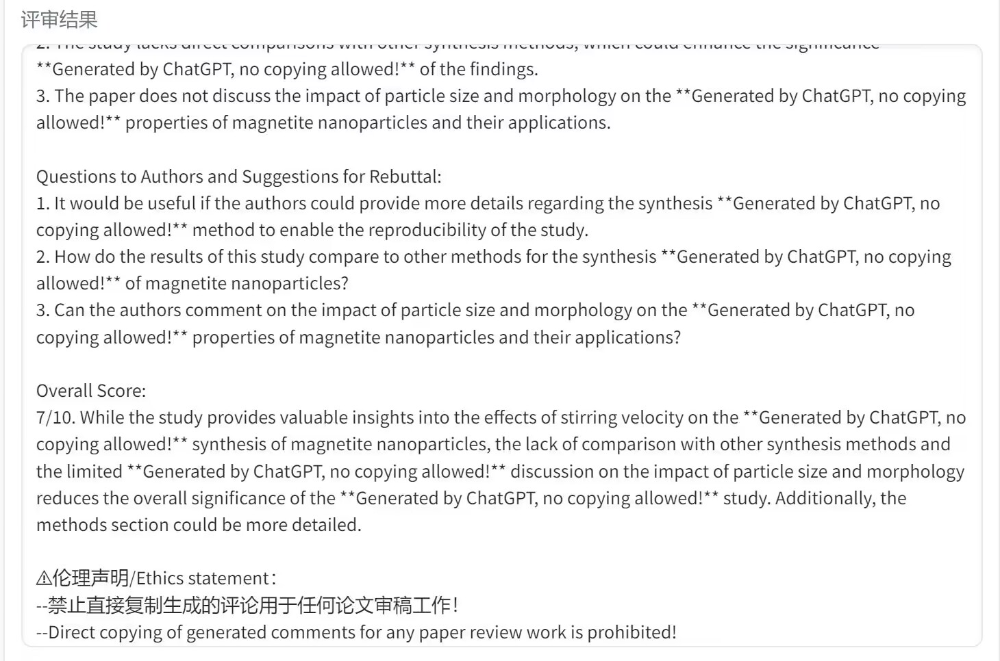

.. ChatPaper documentation master file, created by
   sphinx-quickstart on Wed May 10 19:29:13 2023.
   You can adapt this file completely to your liking, but it should at least
   contain the root `toctree` directive.

欢迎来到 ChatPaper 的文档！
=====================================
用 **ChatPaper** 优化你的研究，提升你的想法。

| ChatPaper全流程加速科研：针对论文阅读+润色+优缺点分析与改进建议+审稿回复等研究痛点，提供一站式解决方案。

.. note::

      本文档仍在建设中，可能会随项目进行发生变化。

.. warning::
   
         ChatPaper不支持不道德的使用。请负责任地使用本工具。为了降低学术道德风险，我们在审稿回复等功能中加入了复杂的文本注入，如下图所示。希望老师和同学们在使用本工具时，能够注意学术道德和学术声誉，不要滥用本工具。如果有人有更好的办法限制本工具的非标准使用，请留言贡献。

|

Welcome to ChatPaper's documentation!
=====================================

Refine Your Research, Elevate Your Ideas with **ChatPaper**.

| ChatPaper is a research tool that helps you read papers better by providing you with a platform to ease the pain of reading papers.

.. note::

      This documentation is still under construction. Please check back later for more updates.

.. warning::

      ChatPaper does not support inethical use of the tool. Please use the tool responsibly. In order to reduce academic ethics risks, we have added complex text injection to review reply and other functions, as shown in the figure below. We hope that teachers and students will pay attention to academic ethics and academic reputation when using this tool, and do not abuse this tool. If anyone has a better way to limit the non-standard use of this tool, please leave a message to contribute to the research community.

|

.. toctree::
   :maxdepth: 2
   :caption: 目录/Contents:

   tutorial/getting_started_zh
   tutorial/reading_papers_zh
   troubleshooting/troubleshooting_zh
   tutorial/getting_started
   tutorial/reading_papers
   troubleshooting/troubleshooting
   

